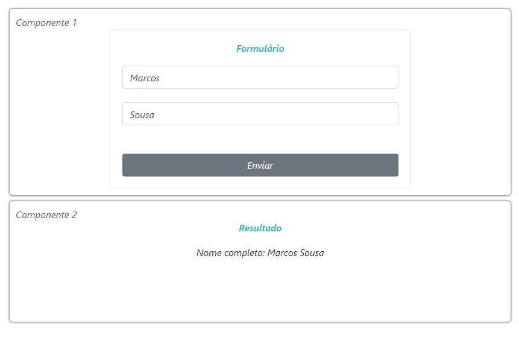

    Neste projeto trago um exemplo de extrutura básica onde podemos aplicar os principais conceitos do Redux, que é uma biblioteca  que permite fazer o gerenciamento do estado da aplicação de forma eficiente.

  

